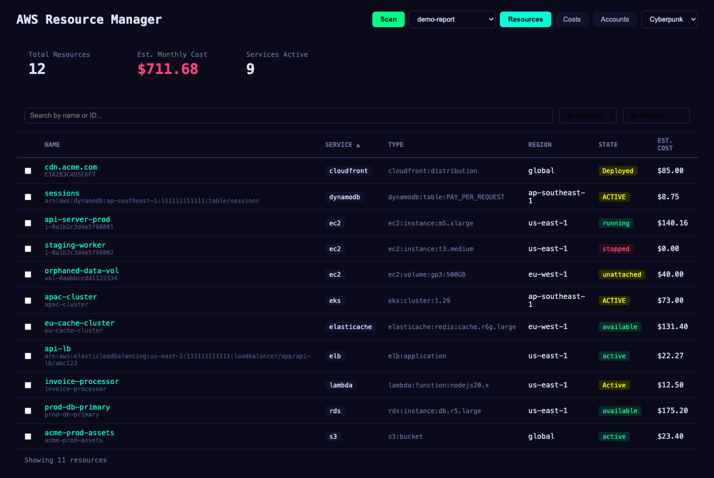

# AWS Resource Manager

[](https://github.com/rawphp/aws-resource-manager/actions/workflows/ci.yml)
[](LICENSE)

Scan all your AWS resources across every region and service, see what you're being charged for, and clean up what you don't need.

Works with multiple AWS accounts. Everything is managed from the web dashboard — add accounts, run scans, view reports, and delete unused resources.



## What It Does

1. **Configure** - Add your AWS accounts from the dashboard
2. **Scan** - Discovers resources across 14 AWS services and all enabled regions
3. **Visualize** - Filterable resource table, cost charts, and waste detection
4. **Clean up** - Select resources for deletion with a confirmation workflow

### Supported Services

EC2 (instances, EBS volumes, Elastic IPs, NAT Gateways), S3, RDS (instances + clusters), Lambda, ELB/ALB, CloudFront, Route 53, ECS (clusters + services), DynamoDB, ElastiCache, Redshift, OpenSearch, SageMaker, EKS

## Quick Start

### 1. Install

```bash
git clone https://github.com/rawphp/aws-resource-manager.git
cd aws-resource-manager
npm install
npm run build
```

Requires **Node.js 18+**.

### 2. Launch the Dashboard

```bash
npm run dev --workspace=packages/web
```

Open `http://localhost:5173`.

### 3. Add an AWS Account

Click the **Accounts** tab, then **Add Account**. Fill in:

- **Name** — A label for this account (e.g., `production`)
- **Access Key ID** — Your AWS access key
- **Secret Access Key** — Your AWS secret key
- **Default Region** *(optional)* — Region for global service discovery (defaults to `us-east-1`)
- **Role ARN** *(optional)* — If you want to assume a cross-account role
- **Session Token** *(optional)* — For temporary credentials

You can add multiple accounts. Credentials are saved to `accounts.yaml` (gitignored — never committed).

### 4. Run a Scan

Click the **Scan** button in the header. The scanner will:

- Discover all enabled regions for each account
- Scan all 14 services across every region
- Fetch cost data from AWS Cost Explorer (last 30 days)
- Generate a report and load it automatically

The button is disabled while a scan is running. When complete, the dashboard refreshes with the new report.

### 5. Review and Clean Up

Switch between the **Resources** and **Costs** tabs to explore your AWS footprint:

- **Resources** — Filter by service, region, account, or search by name/ID. Select resources with checkboxes to add them to the cleanup queue.
- **Costs** — Bar charts showing cost breakdown by service and region, top 10 most expensive resources, and waste detection (stopped instances, unattached EBS volumes, unused Elastic IPs).
- **Cleanup** — Select resources from the table, review the dry-run summary, type `DELETE` to confirm. Shows estimated monthly savings.

## CLI Reference

The scanner can also be used standalone from the command line:

```
aws-resource-manager scan [options]    Run a full scan
aws-resource-manager report [options]  View an existing report
```

### Scan Options

| Flag | Description | Default |
|------|-------------|---------|
| `--config <path>` | Path to accounts YAML config | `./accounts.yaml` |
| `--output <dir>` | Output directory for reports | `./reports` |
| `--account <name>` | Scan only this account | all accounts |
| `--regions <list>` | Comma-separated regions | all enabled |
| `--start-date <date>` | Cost data start (YYYY-MM-DD) | 30 days ago |
| `--end-date <date>` | Cost data end (YYYY-MM-DD) | today |

### Report Options

| Flag | Description |
|------|-------------|
| `--input <path>` | Path to existing report JSON |

## IAM Permissions

The scanning account needs read-only access to the services being scanned. Here's a minimal IAM policy for scanning:

```json
{
  "Version": "2012-10-17",
  "Statement": [
    {
      "Effect": "Allow",
      "Action": [
        "ec2:Describe*",
        "s3:ListAllMyBuckets",
        "s3:GetBucketLocation",
        "s3:GetBucketTagging",
        "rds:DescribeDBInstances",
        "rds:DescribeDBClusters",
        "rds:ListTagsForResource",
        "lambda:ListFunctions",
        "lambda:ListTags",
        "elasticloadbalancing:DescribeLoadBalancers",
        "elasticloadbalancing:DescribeTags",
        "cloudfront:ListDistributions",
        "cloudfront:ListTagsForResource",
        "route53:ListHostedZones",
        "route53:ListResourceRecordSets",
        "route53:ListTagsForResource",
        "ecs:ListClusters",
        "ecs:DescribeClusters",
        "ecs:ListServices",
        "ecs:DescribeServices",
        "ecs:ListTagsForResource",
        "dynamodb:ListTables",
        "dynamodb:DescribeTable",
        "dynamodb:ListTagsOfResource",
        "elasticache:DescribeCacheClusters",
        "elasticache:DescribeReplicationGroups",
        "elasticache:ListTagsForResource",
        "redshift:DescribeClusters",
        "es:ListDomainNames",
        "es:DescribeDomains",
        "es:ListTags",
        "sagemaker:ListNotebookInstances",
        "sagemaker:ListEndpoints",
        "sagemaker:ListTags",
        "eks:ListClusters",
        "eks:DescribeCluster",
        "ce:GetCostAndUsage",
        "sts:GetCallerIdentity"
      ],
      "Resource": "*"
    }
  ]
}
```

For cleanup/deletion, the account also needs write permissions for the targeted services.

## Project Structure

```
packages/
  shared/     Shared TypeScript types
  scanner/    CLI, scanning engine, service scanners, cost integration, cleanup
  web/        React dashboard (Vite)
```

## Development

```bash
npm install
npm run build        # Build all packages
npm run test         # Run all tests
npm run lint         # Run ESLint
```

See [CONTRIBUTING.md](CONTRIBUTING.md) for contribution guidelines and [SECURITY.md](SECURITY.md) for credential management best practices.

## License

[MIT](LICENSE)
